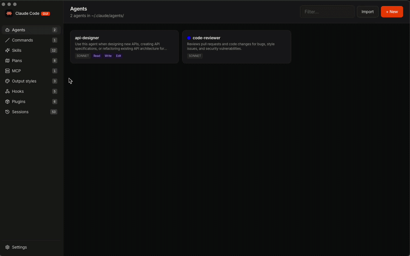

# claude-code-gui

Visual manager for Claude Code agents, commands, skills, plans, plugins, MCP servers, and sessions.



## Features

- Markdown-only editor for agents, commands, skills, and plans — paste a file, slug is derived from the frontmatter `name:` (or first `# Heading` for plans).
- Embedded terminal that launches the `claude` CLI with the selected agent, model, permission mode, output style, and resume session.
- MCP server manager that reads and writes the same `~/.claude.json` (user) and `<project>/.mcp.json` (project) files the CLI uses.
- Live filesystem watcher: external edits to `~/.claude/` show up without a restart.

## Requirements

- The `claude` CLI on `PATH`. On macOS, the app inherits your login-shell `PATH` at startup, so Homebrew / npm-global / nvm installs work without extra config.

## Install (macOS, pre-built)

1. Grab the latest DMG from [Releases](../../releases) (or build one yourself — see below).
2. Drag **Claude Code GUI.app** into `/Applications`.
3. The build is unsigned. On first launch, right-click → **Open**, or strip the quarantine attribute:

   ```bash
   xattr -dr com.apple.quarantine "/Applications/Claude Code GUI.app"
   ```

## Build from source

Prerequisites:
- Rust 1.82+ (pinned via `rust-toolchain.toml`)
- [Bun](https://bun.sh) for the frontend
- Platform build deps per https://tauri.app/start/prerequisites/

```bash
# Install frontend deps
bun install --cwd frontend

# Dev
cd src-tauri && cargo tauri dev

# Release (writes a DMG on macOS, MSI on Windows, AppImage/deb/rpm on Linux)
cargo tauri build
```

Output lands under `target/release/bundle/`.

## Repository layout

```
claude-code-gui/
├── docs/
│   ├── SPEC.md                # full specification
│   ├── decisions/             # ADRs (D1–D16)
│   └── media/                 # screenshots, demo GIFs
├── frontend/                  # Vue 3 + Vite SPA
├── src-tauri/                 # Tauri shell + Rust workspace
│   ├── src/                   # Tauri binary, command bindings, AppState
│   ├── crates/
│   │   ├── core/              # FS domain logic, no Tauri deps
│   │   ├── pty/               # portable-pty wrapper, session manager
│   │   ├── watcher/           # notify + ignore-aware filewatcher
│   │   └── claude_cli/        # claude -p subprocess wrapper
│   ├── tauri.conf.json
│   └── capabilities/
└── .beads/                    # cross-session task tracker
```

## Issue tracking

Multi-session work is tracked in [beads](https://github.com/steveyegge/beads). Run `bd ready` to see unblocked tasks; `bd show <id>` for details.

## License

MIT — see [LICENSE](LICENSE).
